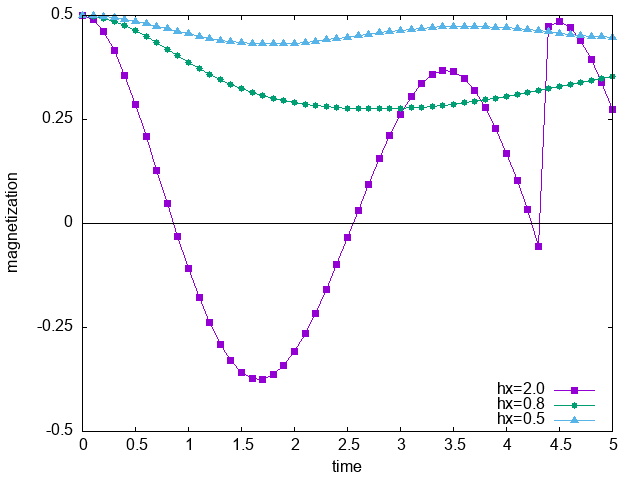

- how to run
    - `export PATH=${WHERE_TENES_INSTALLED}/bin:$PATH`
    - `sh run.sh`
    - `gnuplot plot.plt` for generate a figure
- model
    - Ferromagnetic Ising model on the square lattice
    - Transverse field is induced at t=0 (quench)
        - The critical value is about hx = 1.5
- Inputs
    - `simple.toml`
        - Search for ground state before quench
            - Strictly speaking, this is not necessary because the ground state for hx=0 is available by setting `initial = "ferro"`
        - `Jz = -1`
        - `hx = 0`
    - `simple_te_strong.toml`
        - Time evolution under the strong field
        - `Jz = -1`
        - `hx = 2.0`
    - `simple_te_middle.toml`
        - Time evolution under the moderate field
        - `Jz = -1`
        - `hx = 0.8`
    - `simple_te_weak.toml`
        - Time evolution under the weak field
        - `Jz = -1`
        - `hx = 0.5`
- Observables
    - Magnetization along Sz
- Unitcell
    - 2x2
- Result
    - Time vs magnetization data `magnetization_XXX.dat` (`XXX = strong, middle, weak`) are generated
    - Note that the entanglement grows as the time evolution goes and hence the capacity of the tensor network runs out of capacity to represent the wave function at some point
        - In the following figure, a jump in the case of the strong field at t=4.25 shows this problem

